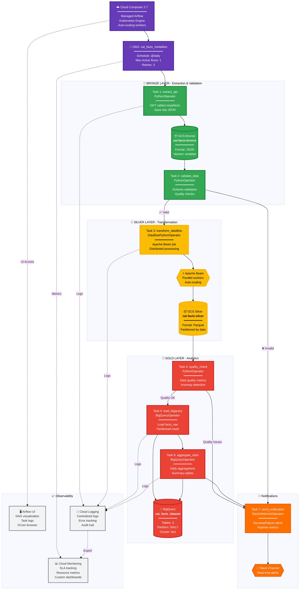

# 🏢 Arquitetura GCP - Cloud Composer + Airflow (Enterprise)
**Solução Robusta e Escalável | Medallion Architecture**

---

## 📊 Diagrama de Fluxo Detalhado



---

## 📋 Características da Solução

### ✅ Vantagens
| Aspecto | Benefício |
|---------|-----------|
| 🎨 **UI Visual** | Airflow UI completa para monitoramento |
| 🔄 **Orquestração** | Controle total de dependências e retries |
| 📊 **Observabilidade** | Logs, métricas e alertas integrados |
| 🔧 **Flexibilidade** | Suporta fluxos complexos e paralelos |
| 🚀 **Escalabilidade** | Auto-scaling de workers |
| 🛡️ **Confiabilidade** | SLA tracking, retry automático |
| 🔌 **Integrações** | 200+ providers prontos |

### ❌ Limitações
| Aspecto | Restrição |
|---------|-----------|
| 💰 **Custo** | $350-400/mês (alto para projetos pequenos) |
| 🏗️ **Complexidade** | Curva de aprendizado maior |
| ⏱️ **Setup** | Deployment leva ~30 minutos |
| 🔧 **Manutenção** | Requer conhecimento de Airflow |
| 📦 **Overhead** | Infraestrutura pesada para pipelines simples |

### 🎯 Casos de Uso Ideais
- ✅ Pipelines complexos com múltiplas dependências
- ✅ Alto volume de dados (> 10 GB/dia)
- ✅ Múltiplos pipelines coordenados
- ✅ Necessidade de SLA rigoroso
- ✅ Equipe grande com experiência em Airflow
- ✅ Ambiente enterprise com governança

---

## 💰 Estimativa de Custos (Mensal)

```
┌──────────────────────────┬────────────────┬────────────┐
│ Recurso                  │ Configuração   │ Custo      │
├──────────────────────────┼────────────────┼────────────┤
│ Cloud Composer (Medium)  │ 1 env          │ $300.00    │
│ ├─ Scheduler             │ 2 CPU, 7.5 GB  │            │
│ ├─ Web Server            │ 1 CPU, 3.75 GB │            │
│ └─ Workers (1-3)         │ 2 CPU, 7.5 GB  │            │
│ GKE (Composer backend)   │ Auto-managed   │ $30.00     │
│ Cloud Storage            │ 100 MB         │ $0.10      │
│ BigQuery Storage         │ 200 MB         │ $0.05      │
│ BigQuery Queries         │ 500 queries    │ $2.50      │
│ Dataflow Jobs            │ 30 jobs/mês    │ $15.00     │
│ Cloud Logging            │ 10 GB/mês      │ $5.00      │
├──────────────────────────┴────────────────┼────────────┤
│ TOTAL MENSAL                              │ ~$350-400  │
└───────────────────────────────────────────┴────────────┘
```

**Otimizações possíveis:**
- 🔻 Environment Small: -$100/mês
- 🔻 Schedule Off-hours: -$50/mês (parar env quando não usar)
- 🔻 Development env: ~$200/mês (config reduzida)

---

## 🏗️ Recursos Criados

**GCP Services:**
- 1× Cloud Composer 2.7 environment
- 1× GKE cluster (managed)
- 2× GCS Buckets (Bronze, Silver) + DAGs bucket
- 1× BigQuery Dataset + 3 Tables
- 2× Service Accounts (Composer, Dataflow)
- VPC + Subnetwork
- Cloud Logging + Monitoring + Alerting

**Airflow Components:**
- 1× DAG com 7 tasks
- 5× Operators (Python, Dataflow, BigQuery, Slack)
- Task Groups para organização
- XCom para comunicação entre tasks
- SLA tracking e alertas

**Detalhes técnicos arquivados em:** `../archive/airflow_detailed/`
