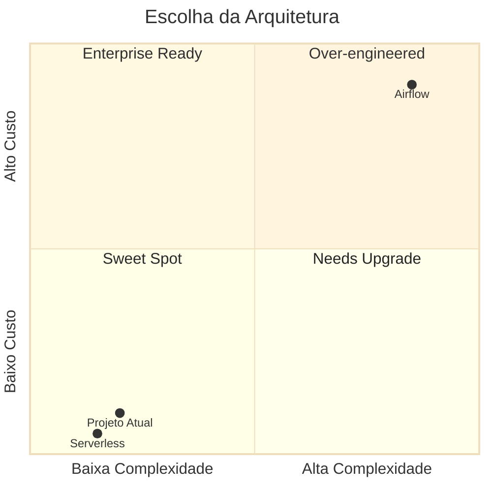

# 🆚 Comparação de Arquiteturas GCP
**Cat Facts Pipeline | Análise Side-by-Side**

---

## 📐 Comparação Visual

```mermaid
%%{init: {'theme':'base', 'themeVariables': { 'fontSize':'12px'}}}%%
graph TB
    subgraph Legend["📌 LEGENDA"]
        L1[🥉 Bronze: Raw Data]
        L2[🥈 Silver: Processed]
        L3[🥇 Gold: Analytics]
    end
    
    subgraph ServerlessArch["🔄 ARQUITETURA SERVERLESS (Scheduler + Functions)"]
        direction TB
        
        S_Start([⏰ Cloud Scheduler<br/>Cron: @daily])
        
        subgraph S_Bronze["🥉 BRONZE"]
            S_CF1[Cloud Function<br/>extract_cat_facts<br/>256MB | 60s]
            S_API{{API External}}
            S_GCS_B[(GCS Bronze<br/>JSON)]
        end
        
        subgraph S_Silver["🥈 SILVER"]
            S_CF2[Cloud Function<br/>transform_to_silver<br/>512MB | Pandas]
            S_GCS_S[(GCS Silver<br/>Parquet)]
        end
        
        subgraph S_Gold["🥇 GOLD"]
            S_CF3[Cloud Function<br/>load_to_gold<br/>512MB | BQ SDK]
            S_BQ[(BigQuery<br/>Analytics)]
        end
        
        S_Start -->|HTTP| S_CF1
        S_CF1 --> S_API
        S_CF1 --> S_GCS_B
        S_GCS_B -->|Event| S_CF2
        S_CF2 --> S_GCS_S
        S_GCS_S -->|Event| S_CF3
        S_CF3 --> S_BQ
    end
    
    subgraph AirflowArch["🏢 ARQUITETURA ENTERPRISE (Composer + Airflow)"]
        direction TB
        
        A_Start([☁️ Cloud Composer<br/>Managed Airflow])
        A_DAG[📜 DAG<br/>7 tasks | Retries]
        
        subgraph A_Bronze["🥉 BRONZE"]
            A_T1[Task: extract_api<br/>PythonOperator]
            A_T2[Task: validate<br/>Quality checks]
            A_GCS_B[(GCS Bronze<br/>JSON)]
        end
        
        subgraph A_Silver["🥈 SILVER"]
            A_T3[Task: transform<br/>DataflowOperator]
            A_Beam{{Apache Beam<br/>Distributed}}
            A_GCS_S[(GCS Silver<br/>Parquet)]
        end
        
        subgraph A_Gold["🥇 GOLD"]
            A_T4[Task: quality<br/>PythonOperator]
            A_T5[Task: load_bq<br/>BigQueryOperator]
            A_T6[Task: aggregate<br/>BigQueryOperator]
            A_BQ[(BigQuery<br/>3 tables)]
        end
        
        A_T7[Task: notify<br/>SlackOperator]
        
        A_Start --> A_DAG
        A_DAG --> A_T1
        A_T1 --> A_GCS_B
        A_GCS_B --> A_T2
        A_T2 --> A_T3
        A_T3 --> A_Beam
        A_Beam --> A_GCS_S
        A_GCS_S --> A_T4
        A_T4 --> A_T5
        A_T5 --> A_BQ
        A_T5 --> A_T6
        A_T6 --> A_BQ
        A_T6 --> A_T7
    end
    
    classDef serverless fill:#4285f4,stroke:#1967d2,stroke-width:2px,color:#fff
    classDef airflow fill:#673ab7,stroke:#4527a0,stroke-width:2px,color:#fff
    classDef bronze fill:#34a853,stroke:#188038,stroke-width:2px,color:#fff
    classDef silver fill:#fbbc04,stroke:#f9ab00,stroke-width:2px,color:#000
    classDef gold fill:#ea4335,stroke:#c5221f,stroke-width:2px,color:#fff
    
    class S_Start,S_CF1,S_CF2,S_CF3 serverless
    class A_Start,A_DAG,A_T1,A_T2,A_T3,A_T4,A_T5,A_T6,A_T7 airflow
```

---

## 📊 Matriz de Comparação Completa

| Critério | 🔄 Serverless (Scheduler) | 🏢 Enterprise (Airflow) |
|----------|---------------------------|-------------------------|
| **💰 Custo/mês** | $3-5 | $350-400 |
| **⚡ Setup inicial** | < 10 min | ~30 min |
| **🏗️ Infraestrutura** | Zero (fully managed) | GKE cluster + Composer |
| **📊 UI Visual** | ❌ Não | ✅ Airflow Web UI |
| **🔄 Orquestração** | Event-driven chain | DAG com dependências |
| **🔁 Retry Logic** | Básico (automatic) | Avançado (configurável) |
| **📈 Observabilidade** | Cloud Logging | Airflow UI + Logging |
| **⏱️ Timeout** | 9 min (Gen2) | Ilimitado |
| **📦 Volume máximo** | < 10 GB/dia | > 100 GB/dia |
| **🔧 Complexidade** | ⭐ Simples | ⭐⭐⭐⭐ Complexo |
| **👥 Equipe ideal** | 1-3 pessoas | 5+ pessoas |
| **📚 Curva aprendizado** | Baixa | Alta |
| **🔌 Integrações** | Limitado | 200+ operators |
| **🎯 SLA Tracking** | Manual | Nativo |
| **📊 Paralelismo** | Limitado | Ilimitado |
| **🔒 Segurança** | IAM per function | IAM + RBAC |
| **🧪 Ambiente dev** | Same config | Composer separado |
| **📝 Logs retention** | 30 dias (default) | Customizável |
| **🚨 Alerting** | Cloud Monitoring | Airflow + Slack + Email |
| **🔄 Backfill** | Manual | Nativo (CLI) |

---

## 🎯 Matriz de Decisão



### 📍 Recomendação por Cenário

#### ✅ Use **SERVERLESS** quando:
- Volume de dados < 10 GB/dia
- Pipeline linear (Bronze → Silver → Gold)
- Frequência: diária ou menor
- Orçamento limitado (< $50/mês)
- Equipe pequena (1-3 pessoas)
- Prototipagem rápida
- **Exemplo:** Projeto atual Cat Facts (327 records/dia)

#### ✅ Use **AIRFLOW** quando:
- Volume de dados > 10 GB/dia
- Pipelines complexos com múltiplas dependências
- Necessidade de UI visual para monitoramento
- SLA rigoroso com alertas
- Múltiplos pipelines coordenados
- Equipe enterprise (5+ pessoas)
- **Exemplo:** ETL multi-source com transformações complexas

---

## 🔄 Migração entre Arquiteturas

### Serverless → Airflow
**Quando migrar:**
- Pipeline cresceu além de 10 GB/dia
- Necessidade de orquestração visual
- Múltiplas dependências entre tasks
- SLA tracking obrigatório

**Esforço:** 2-3 semanas
- Reescrever Cloud Functions como Airflow tasks
- Criar DAG com dependências
- Setup Composer environment
- Testes e validação

### Airflow → Serverless
**Quando migrar:**
- Redução de custos ($350 → $5/mês)
- Pipeline simplificou
- Volume de dados diminuiu
- Equipe reduziu

**Esforço:** 1-2 semanas
- Converter tasks em Cloud Functions
- Implementar event triggers
- Remover Composer environment
- Validação

---

## 💡 Recomendação Final para Cat Facts

### ✅ Escolha: **SERVERLESS (Scheduler + Functions)**

**Justificativa:**
- ✅ Volume: 327 records/dia (~50 KB) - muito abaixo do limite
- ✅ Custo: $3-5/mês (98% mais barato que Airflow)
- ✅ Simplicidade: Pipeline linear sem dependências complexas
- ✅ Frequência: 1x por dia - não precisa orquestração sofisticada
- ✅ Equipe: Projeto individual/pequena equipe
- ✅ Manutenção: Praticamente zero

**Quando revisar:**
- ❗ Volume > 1 GB/dia
- ❗ Necessidade de processar múltiplas APIs
- ❗ SLA < 30 minutos obrigatório
- ❗ Equipe crescer para 5+ pessoas

---

## 📁 Estrutura de Arquivos

```
gcp_architecture/
├── README.md (este arquivo)
├── comparison_diagram.md (comparação visual)
│
├── scheduler_approach/
│   └── architecture_diagram.md (Mermaid detalhado)
│
├── airflow_approach/
│   └── architecture_diagram.md (Mermaid detalhado)
│
└── archive/
    ├── scheduler_detailed/
    │   ├── documentation.md (código Python completo)
    │   └── terraform/
    │       └── main.tf (IaC completo)
    │
    └── airflow_detailed/
        ├── dags/
        │   └── cat_facts_pipeline.py (DAG completo)
        └── terraform/
            └── main.tf (IaC completo)
```

---

## 🚀 Próximos Passos

1. ✅ **Validar escolha** com stakeholders
2. ✅ **Implementar Serverless** (recomendado)
3. ✅ **Deploy com Terraform** (arquivo em archive/)
4. ✅ **Configurar monitoramento** básico
5. ✅ **Testar pipeline** end-to-end
6. ✅ **Documentar** processo de deploy

---

**Data:** 27/01/2026  
**Autor:** GitHub Copilot  
**Projeto:** UOLCatLovers - Question 2
