# 🔄 Arquitetura GCP - Scheduler + Functions (Serverless)
**Solução Simples e Econômica | Medallion Architecture**

---

## 📊 Diagrama de Fluxo Detalhado

```mermaid
%%{init: {'theme':'base', 'themeVariables': { 'fontSize':'14px'}}}%%
graph TB
    %% TRIGGER LAYER
    Start([🕐 Início<br/>09:00 UTC Diário])
    Scheduler[Cloud Scheduler<br/>⏰ Cron Job<br/>schedule: 0 9 * * *]
    
    %% BRONZE LAYER
    subgraph Bronze["🥉 BRONZE LAYER - Raw Data Ingestion"]
        direction TB
        CF1[☁️ Cloud Function 1<br/><b>extract_cat_facts</b><br/>━━━━━━━━━━━<br/>Runtime: Python 3.11<br/>Memory: 256MB<br/>Timeout: 60s]
        API{{🌐 External API<br/>catfact.ninja/facts<br/>~327 records}}
        Validate1{✅ Validação<br/>Status 200?}
        GCS_Bronze[(📦 GCS Bronze<br/><b>cat-facts-bronze</b><br/>━━━━━━━━━━━<br/>Format: JSON<br/>Lifecycle: 90d → Nearline)]
    end
    
    %% SILVER LAYER
    subgraph Silver["🥈 SILVER LAYER - Data Transformation"]
        direction TB
        Event1[📣 Event Trigger<br/>finalize/create]
        CF2[☁️ Cloud Function 2<br/><b>transform_to_silver</b><br/>━━━━━━━━━━━<br/>Runtime: Python 3.11<br/>Memory: 512MB<br/>Pandas + PyArrow]
        Transform[🔄 Processing<br/>• Parse JSON<br/>• Add timestamps<br/>• Deduplicate<br/>• Convert to Parquet]
        GCS_Silver[(📦 GCS Silver<br/><b>cat-facts-silver</b><br/>━━━━━━━━━━━<br/>Format: Parquet<br/>Compression: Snappy)]
    end
    
    %% GOLD LAYER
    subgraph Gold["🥇 GOLD LAYER - Analytics Ready"]
        direction TB
        Event2[📣 Event Trigger<br/>finalize/create]
        CF3[☁️ Cloud Function 3<br/><b>load_to_gold</b><br/>━━━━━━━━━━━<br/>Runtime: Python 3.11<br/>Memory: 512MB<br/>BigQuery Client]
        Load[📊 Load Process<br/>• Schema validation<br/>• Partitioned insert<br/>• Clustering by fact]
        BQ[(🏢 BigQuery<br/><b>cat_facts_dataset</b><br/>━━━━━━━━━━━<br/>Table: facts_raw<br/>Partition: DAILY<br/>Cluster: fact)]
    end
    
    %% MONITORING
    subgraph Monitor["📈 Observability Stack"]
        direction LR
        Logs[📝 Cloud Logging<br/>All function logs]
        Metrics[📊 Cloud Monitoring<br/>Invocations, errors, latency]
        Alerts[🚨 Alerting<br/>Email/Slack on failures]
    end
    
    %% CONNECTIONS
    Start --> Scheduler
    Scheduler -->|HTTP POST| CF1
    CF1 --> API
    API --> Validate1
    Validate1 -->|✅ Success| GCS_Bronze
    Validate1 -->|❌ Error| Logs
    
    GCS_Bronze --> Event1
    Event1 -->|Trigger| CF2
    CF2 --> Transform
    Transform --> GCS_Silver
    
    GCS_Silver --> Event2
    Event2 -->|Trigger| CF3
    CF3 --> Load
    Load --> BQ
    
    CF1 -.->|Stream logs| Logs
    CF2 -.->|Stream logs| Logs
    CF3 -.->|Stream logs| Logs
    Logs -->|Export| Metrics
    Metrics -->|Conditions| Alerts
    
    %% STYLING
    classDef trigger fill:#4285f4,stroke:#1967d2,stroke-width:3px,color:#fff
    classDef bronze fill:#34a853,stroke:#188038,stroke-width:3px,color:#fff
    classDef silver fill:#fbbc04,stroke:#f9ab00,stroke-width:3px,color:#000
    classDef gold fill:#ea4335,stroke:#c5221f,stroke-width:3px,color:#fff
    classDef storage fill:#e8f0fe,stroke:#4285f4,stroke-width:2px
    classDef monitor fill:#f1f3f4,stroke:#5f6368,stroke-width:2px
    
    class Start,Scheduler trigger
    class CF1,Validate1,API bronze
    class Event1,CF2,Transform silver
    class Event2,CF3,Load gold
    class GCS_Bronze,GCS_Silver,BQ storage
    class Logs,Metrics,Alerts monitor
```



---

## 📋 Características da Solução

### ✅ Vantagens
| Aspecto | Benefício |
|---------|-----------|
| 💰 **Custo** | ~$3-5/mês (extremamente econômico) |
| ⚡ **Serverless** | Zero infraestrutura para gerenciar |
| 🔄 **Auto-scaling** | Escala automaticamente com demanda |
| 🎯 **Event-driven** | Reação automática a novos dados |
| 🛠️ **Simplicidade** | Fácil de entender, implementar e manter |
| 🔒 **Segurança** | IAM granular por função |

### ❌ Limitações
| Aspecto | Restrição |
|---------|-----------|
| ⏱️ **Timeout** | Máximo 9 minutos (Gen2) |
| 📊 **Visibilidade** | Sem UI de orquestração visual |
| 🔁 **Retry** | Lógica de retry básica |
| 🐛 **Debug** | Mais difícil para fluxos complexos |
| 📈 **Volume** | Ideal para < 10 GB/dia |

### 🎯 Casos de Uso Ideais
- ✅ Pipelines simples e lineares
- ✅ Baixo a médio volume de dados
- ✅ Frequência diária ou menor
- ✅ Orçamento limitado
- ✅ Equipe pequena
- ✅ Prototipagem rápida

---

## 💰 Estimativa de Custos (Mensal)

```
┌─────────────────────┬──────────────┬────────────┐
│ Recurso             │ Volume       │ Custo      │
├─────────────────────┼──────────────┼────────────┤
│ Cloud Scheduler     │ 30 jobs      │ $0.10      │
│ Cloud Functions (3) │ 90 calls     │ $0.00 *    │
│ Cloud Storage       │ 10 MB        │ $0.02      │
│ BigQuery Storage    │ 50 MB        │ $0.01      │
│ BigQuery Queries    │ 100 queries  │ $0.50      │
├─────────────────────┴──────────────┼────────────┤
│ TOTAL MENSAL                       │ ~$3-5      │
└────────────────────────────────────┴────────────┘
* Free tier: 2M calls/mês
```

---

## 🏗️ Recursos Criados

**GCP Services:**
- 1× Cloud Scheduler job
- 3× Cloud Functions (Gen2)
- 2× GCS Buckets (Bronze, Silver)
- 1× BigQuery Dataset + Tables
- 3× Service Accounts
- Cloud Logging + Monitoring

**Detalhes técnicos arquivados em:** `../archive/scheduler_detailed/`
